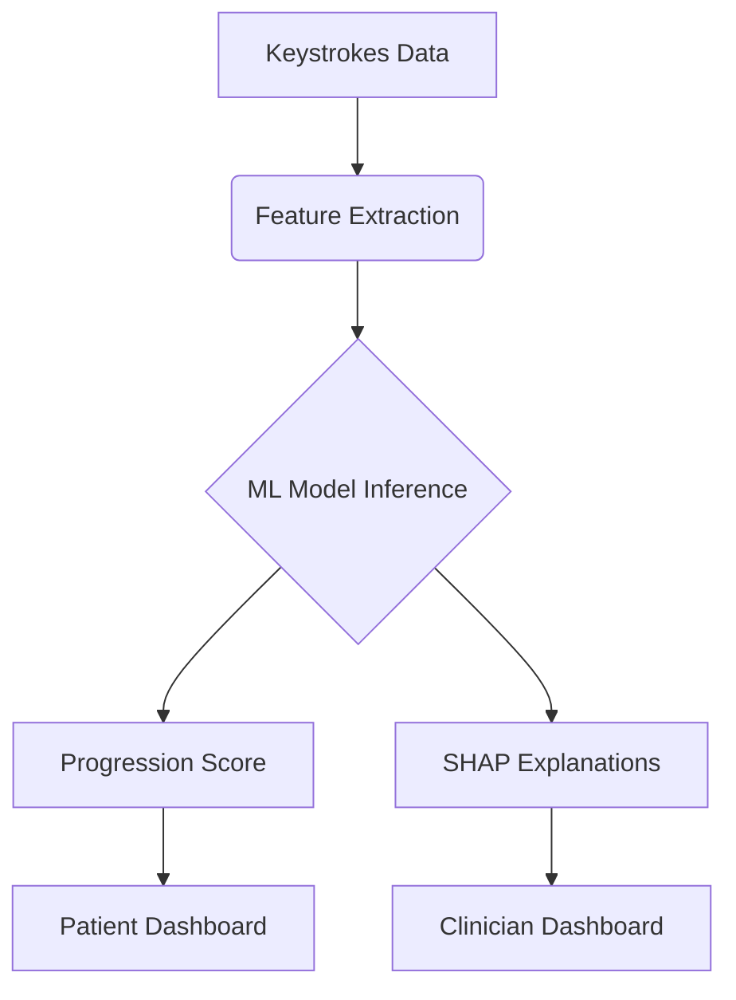

# NeuroType: Parkinson's Disease Progression Tracker

[](https://opensource.org/licenses/MIT)
[](https://www.python.org/)
[](https://github.com/ellerbrock/open-source-badges/)

NeuroType is an AI-powered smartphone application that passively monitors Parkinson's Disease (PD) progression using keystroke dynamics. By analyzing natural typing patterns, it detects subtle motor degradation 6-12 months earlier than traditional clinical assessments.

## 🔍 Problem Addressed
Parkinson's disease progression is currently tracked through:
- Infrequent clinical visits (every 6-12 months)
- Subjective MDS-UPDRS assessments
- Manual symptom diaries with recall bias

**Neurotype solves these by providing:**  
✅ Continuous 24/7 monitoring  
✅ Objective, data-driven progression scoring  
✅ Early detection of motor symptom changes  

## ✨ Key Features
- **Passive Monitoring**: Runs in background during normal typing
- **PD Progression Score**: MDS-UPDRS-aligned metric (0-4 scale)
- **Explainable AI**: SHAP-powered insights for clinicians
- **Drug Efficacy Tracking**: Correlates medication timing with motor function
- **Clinical Dashboard**: Web portal for healthcare providers
- **Privacy-First Design**: Never stores typed content, only metadata

## 🧠 How It Works


---

## 📁 Project Structure
```
NeuroType-main/
  app.py                # Main Flask application
  requirements.txt      # Python dependencies
  models/               # ML models and scalers
  templates/            # HTML templates (frontend)
  static/               # Static files (CSS, JS, images)
  logs/                 # User logs
  ...
```

---

## 🚀 Deployment on Render

### 1. Prerequisites
- Python 3.8+
- A Render.com account
- This repository (clone or fork)

### 2. Render Service Settings
- **Service Type:** Web Service
- **Root Directory:** `NeuroType-main`
- **Start Command:** `gunicorn app:app`
- **Build Command:** (leave blank unless you need extra steps)

### 3. Environment Variables (if needed)
- Add any required environment variables in the Render dashboard.

### 4. requirements.txt
Make sure your `requirements.txt` includes:
```
Flask
gunicorn
pandas
numpy
scikit-learn
xgboost
matplotlib
seaborn
shap
ipywidgets
jupyter
streamlit
```

### 5. File Structure
- All code should be inside the `NeuroType-main` directory.
- `app.py` must be at the root of `NeuroType-main`.
- Templates and static files must be in their respective folders.

### 6. Deploy
- Push your code to GitHub/GitLab/Bitbucket.
- Connect your repo to Render.
- Set the above settings and deploy.
- Visit your Render URL to use the app.

---

## 🖥️ Local Development
1. Clone the repository:
   ```bash
   git clone <repo-url>
   cd NeuroType-main
   ```
2. Install dependencies:
   ```bash
   pip install -r requirements.txt
   ```
3. Run the Flask app:
   ```bash
   python app.py
   ```
4. Open your browser to [http://127.0.0.1:5000](http://127.0.0.1:5000)

---

## 🛠️ Troubleshooting & FAQ

**Q: I get a 404 Not Found error on Render!**
- Make sure your `Start Command` is `gunicorn app:app`.
- Ensure `app.py` is in the root of `NeuroType-main`.
- Check that `requirements.txt` includes `Flask` and `gunicorn`.
- Make sure your templates and static folders are present and correctly named.
- Check the Render logs for errors (missing files, import errors, etc).

**Q: My ML model or scaler file is not found!**
- Ensure the `models/` directory and all required files are pushed to your repo.
- Use relative paths in your code (as in `models/rf_pd_model.pkl`).

**Q: How do I update the app after deployment?**
- Push your changes to your repo. Render will auto-deploy.

**Q: Can I use this on Vercel?**
- Not recommended. Vercel does not support full Flask web apps with HTML templates. Use Render, Heroku, or PythonAnywhere for best results.

---

## 📸 Screenshots
screenshots of web app are here for reference inside the repo.

---

**Enjoy using NeuroType!**
